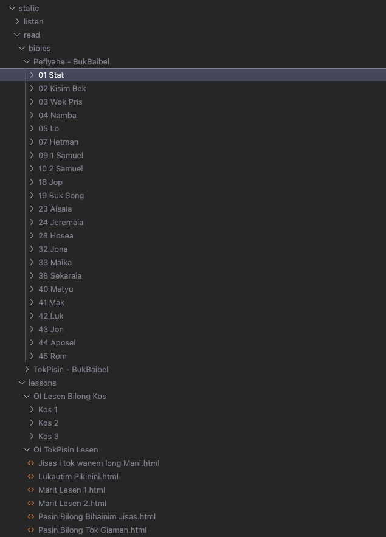

<p align="center">
  <a href="https://github.com/actovos-consulting-group/baibel"></a>
</p>

<p align="center">
   Bible Translation App
</p>

<p align="center">
  <a href="#badge"></a>
  <a href="#badge"></a>
</p>

## Overview

Baibel is an app that provides biblical translations to remote users where there may be no wifi or internet service. The app functions completely offline and uses no external API or http requests. All the data is bundled statically with the app which includes markdown for the biblical books and .mp3 audio files. Currently this app is only been tested and optimized for Android.

## Setup

```
npm i
```

```
react-native run-android
```

## Instructions to compile Audio and Books

1. Create a `static` directory in the root of the project.

2. Copy your listen and read files into the directory. (The structure should look like the following). It's important the structure match the example. Additional nesting will cause issues.



3. Run the compilation script. `node generate-app-data.js`. If you have issues running ensure your node version is `12.15.0`. This will compile your assets into the proper directories and formats to be consumed by the app.

4. Next either run the app for development or generate an apk file.

## To Generate an APK

1. Ensure you have latest version of android studio installed.
2. Navigate into the `android` folder.
3. Run `./gradlew assembleRelease`. The APK will exist in the following folder.


