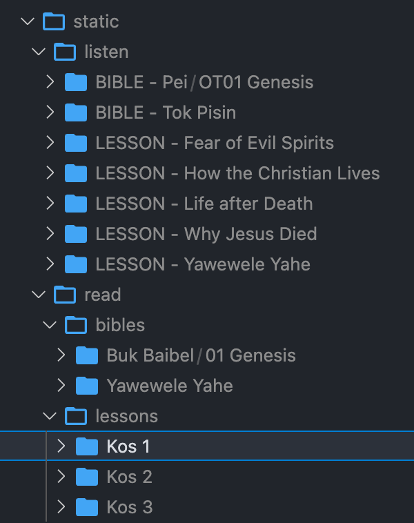
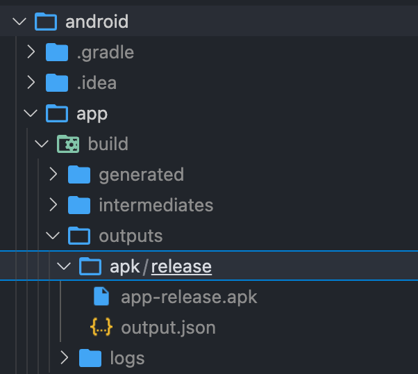

## Overview

Baibel provides Bible Translations and Media to remote users where there may be no wifi or internet service. The app functions completely offline and uses no external API or http requests. 

All the data is bundled statically with the app -- .mp3 audio files, and html for reading. Currently this app has only been tested and optimized for Android.

## Setup

```
npm i
```

```
react-native run-android
```

## Instructions to compile Audio and Books

1. Create a `static` directory in the root of the project.

2. Make sure there is an empty directory called 'raw' at `android/app/src/main/res`

3. Copy your listen and read files into the 'static' directory made in step 1. (The structure should look like the following)



3. At the root of the project, run the compilation script. `node generate-app-data.js`.  
If you have issues running, our node version is `12.15.0`... A newer version *might* break things. This script will move the stuff from the 'static' directory, and put things into the proper directories and formats to be consumed by the app.

4. Check the 'raw' directory you made in step 2... it should have media files in it now.

5. Now, time to build an APK or run the app for development.

## To Generate an APK

1. Ensure you have latest version of android studio installed.
2. Navigate into the `android` folder.
3. Run `./gradlew assembleRelease`. The APK will exist in the following folder.


